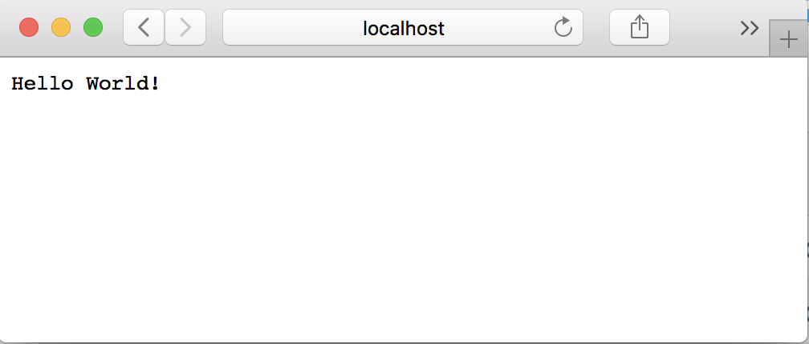
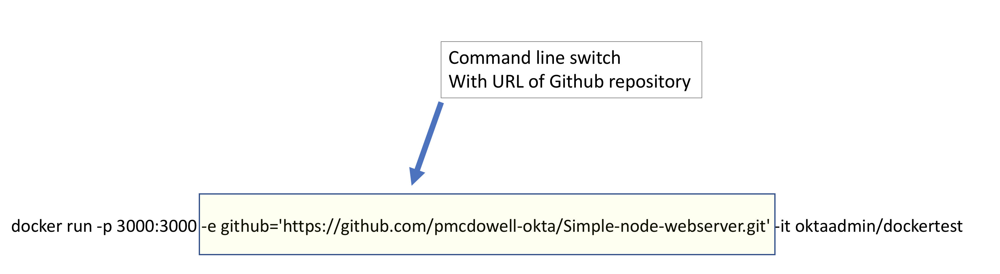
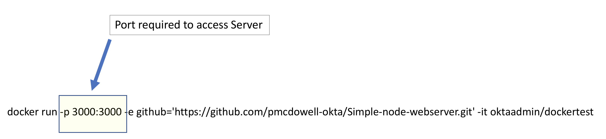

## Testing your Github Repo(s) with Docker

How many times have you checked your code into Github, just to have someone else check it out, just to find out there was some dependency missing, and they could not get it to run.

I rely heavily on Docker for my build environment, and before I release anything to a team mate, I like to run it through a quick test in Docker to make sure everything is working properly.

This approach is simple, and only relies on Docker, git and a very simple make file. This approach could easily be integrated into an automated build system to achieve Continuous Integration

## Try it out !

Below is a running example of this, it is a simple Node Helloworld Web Server running on port
3000. Just run this command:

`docker run -p 3000:3000 -e github='https://github.com/pmcdowell-okta/dockertest.git' -it oktaadmin/dockertest`

Then, connect to **http://localhost:3000**

You should see a web page displaying Hello World, like below:



## How does it work

For the purposes of this example, I am using the **Node**. Node is a very simple, below I will
have some other examples that use a two step build process.

#### It works like this:

1. **Launch Docker Image**   Launches Docker with an Environment variable to a **Github** repository
2. **pull**   Clones the **github** repository into the docker image
3. **builds**   Builds the full project
4. **run**    Launches the project   

##### What is required

Only two things are required to perform this:

* **Makefile**
* **Docker Image**

###### The Makefile

This is an example of the Makefile I use, the Makefile is very simple, you can certainly do
it your own way, but this is basically what I use. Ideally, the Makefile should pull down
any required packages (the Github will be pulled from the Docker Image automatically), then
it should perform the build, and launch the application. 

**Below is an example I used for a Node Language example**

``` 
#Sample from https://github.com/pmcdowell-okta/Simple-node-webserver
setup:
	npm install http

build:
	echo "nothing to build, this Node, but thank you for thinking of me"

run:
	node index.js

dockertest:
	make setup
	make build
	make run
```

**Below is an example I used for a Go Language example**

``` 
#Simple Makefile from https://github.com/pmcdowell-okta/hackey-golang-build

GOPATH=$(shell pwd)
SHELL := /bin/bash
PATH := bin:$(PATH)

setup:
	@GOPATH=$(GOPATH) go get "github.com/gorilla/mux"
	@GOPATH=$(GOPATH) go get "github.com/elazarl/go-bindata-assetfs"
	@GOPATH=$(GOPATH) go get github.com/jteeuwen/go-bindata/...
	@GOPATH=$(GOPATH) go get github.com/elazarl/go-bindata-assetfs/...
	
build: 
	@GOPATH=$(GOPATH) go build ./...
	@GOPATH=$(GOPATH) go install ./...

run: 
	bin/main


#This runs setup, build, and launches the application
dockertest:
    make setup
    make build
    make run

```

Your Makefile might have some special requirement that I might not include,
so you could need to tune the Makefile for you build, but the idea is still
the same.

The **Docker** image is going to launch the Makefile with the **dockertest**
switch. You can also test your build locally by just running

`make dockertest`

If it works in your environment, and you added all the dependencies to the
Makefile, it *"should"* work for the Docker Image.

### The Dockerfile

For the **Dockerfile** I try to keep this as lean as possible. I typically start with a base **Ubuntu** image. I add the required language(s) such as **GO**, **Node.js** or what ever language I am using.

The special sauce is a few commands that I put in the **Dockerfile** which launches the **Makefile**
from the **Github** repository. This is what one of my Dockerfiles looks like:

##### Dockerfile

```
FROM oktaadmin/awscli 
#You can start with any base Docker Image that works for you

RUN echo "#!/bin/bash\n" > /startscript.sh
RUN echo "mkdir github\n" >> /startscript.sh
RUN echo "cd github\n" >> /startscript.sh
RUN echo "git clone \$github\n" >> /startscript.sh
RUN echo "cd *\n" >> /startscript.sh
RUN echo "make dockertest\n" >> /startscript.sh

RUN chmod +x /startscript.sh

CMD /startscript.sh
```

*If you are new to Docker, and want to build your own Image the command to build the Docker 
Image, just cut and paste the code above, and run the command below.*

`docker build -t dockertest .`

Obviously, your more than welcome to use my images, but if you have some base
images that you use, then use your own.

##### The Special Sauce

The special sauce is passing an Enviornment variable into the Docker command line interface,
which provides the URL where the Docker Image is going to pull down the *Github* repository.



For this example, I needed to allow *Port 3000* to be able to access the guest
Docker Image, so I added that as well.





